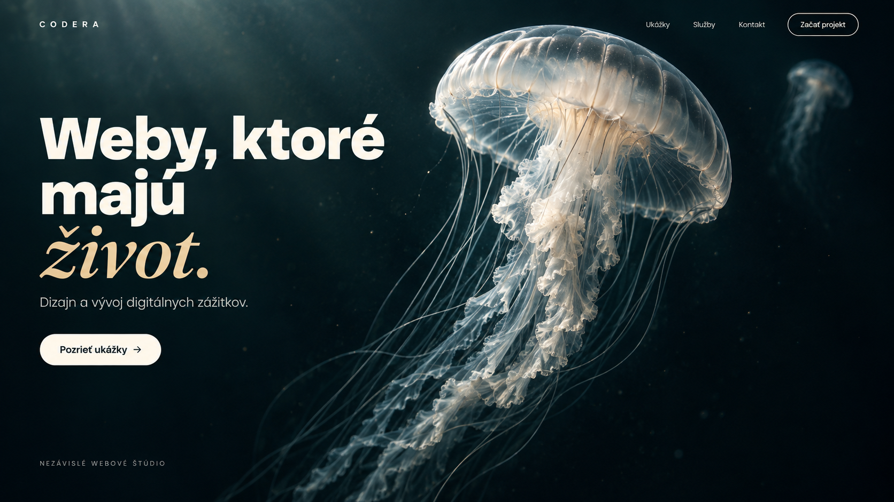
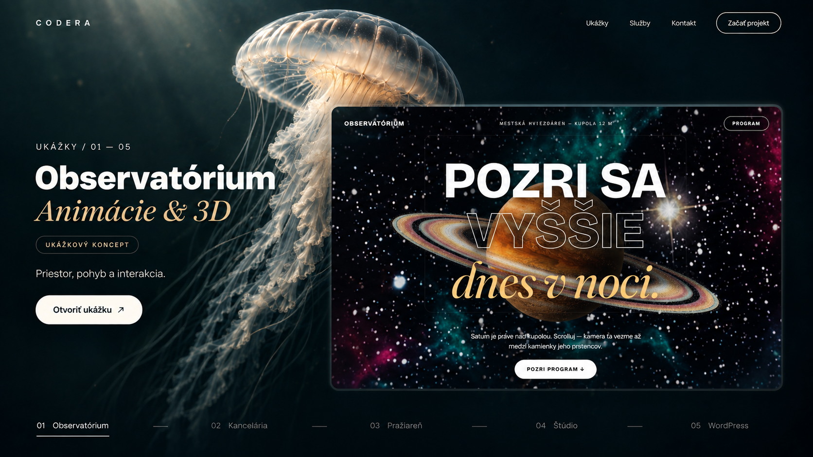
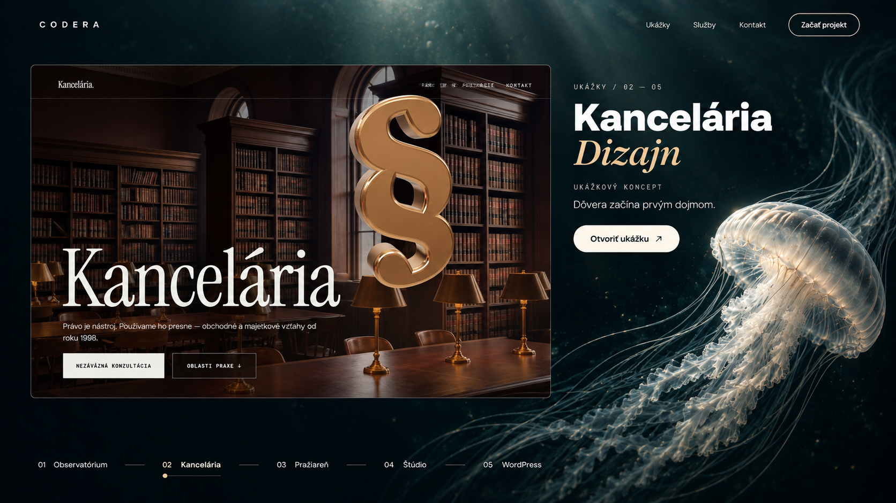
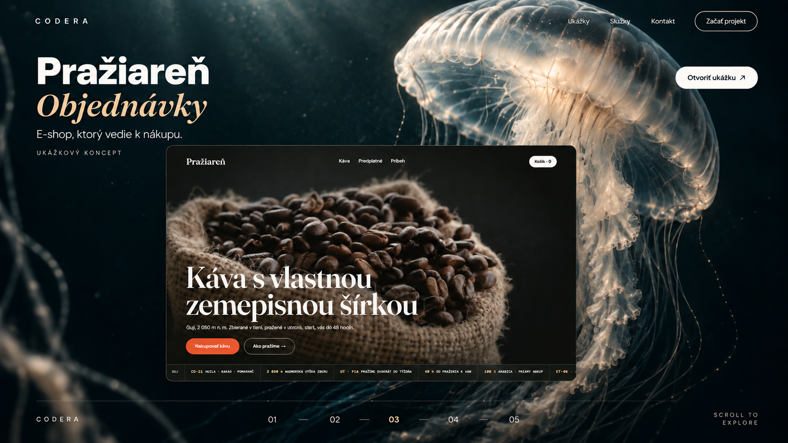
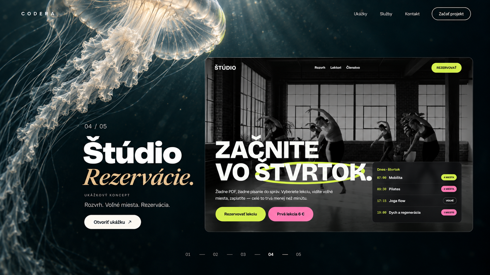
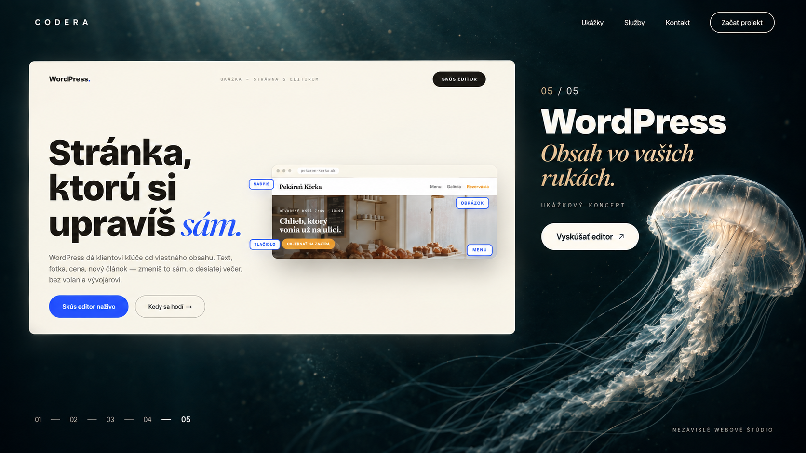
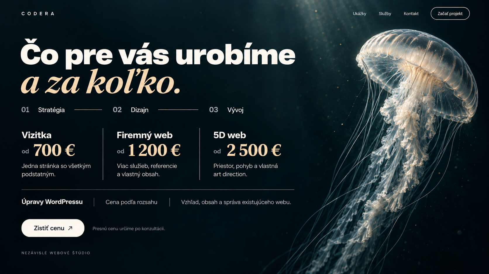
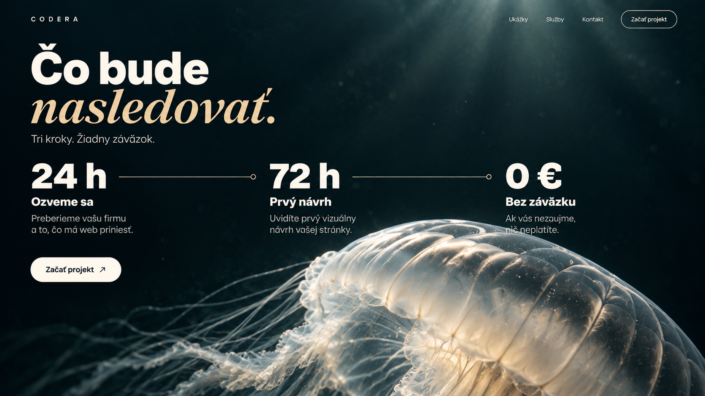
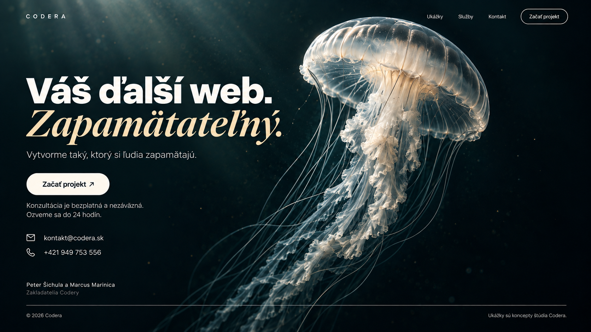

# Codera — jellyfish visual study, 2026-09-16

Status: visual exploration requested by Marcus. Eight new section keyframes plus the previously approved hero. No website implementation or deployment. This study does not approve or silently replace the existing implementation contracts.

## Latest motion decisions — supersedes the per-project transitions below

Marcus rejected the generated section images as a motion solution: they repeat a composition with a jellyfish near content, whereas the required experience uses scroll-controlled camera proximity, retreat, perspective changes, and changes in the surrounding space. Keep the images only as visual style and content studies, not as approved motion keyframes.

The revised journey retains the discussed open-water, macro-detail, narrow mineral-space, wide-space, light ascent and returning-contact ideas for development between major sections. Section 2 contains ALL five portfolio examples with ordinary scrolling and no animated transitions between individual examples. The spatial journey pauses through that portfolio block and resumes after the final example. Do not reinstate separate film transitions for each project. The hero-to-portfolio transition still needs stronger choreography; placement of the other spatial beats between major sections remains to be resolved.

Marcus asks how far an initial implementation can go on an older 8 GB PC without overloading it. No final jellyfish video or rigged model currently exists. A lightweight spatial prototype would validate camera movement, scale changes and the portfolio pause; it would not validate the final photorealistic rendering. Do not silently substitute zooming the generated website screenshots for a spatial prototype. Higgsfield video is a possible later production route mentioned by Marcus, not an instruction to generate video now.

## Direction and sources

Marcus approved the cinematic, clean jellyfish hero direction for exploration. The same organism should anchor the whole journey. Avoid the previously rejected C/logo centerpiece, kitsch, neon aquarium colors, and unrelated scene worlds. Preserve Bricolage Grotesque 800 and Fraunces italic in the actual website; generated lettering is only an approximation.

Content was checked on the live https://www.codera.sk on 2026-09-16 using the browser. Existing portfolio references are public/home/demos/{animacie-3d,dizajn,objednavky,rezervacie,wordpress}-1600.jpg. Search-index content differed from the live page, so live prices and contacts were used: Vizitka from 700 EUR, Firemny web from 1200 EUR, 5D web from 2500 EUR, WordPress by quote; 24 h reply, 72 h proposal, 0 EUR if not interested. Reconfirm business facts against lib/site-config.ts before implementation.

Visual reference: the user-approved hero below; broader user reference is oryzo.ai. This study does not claim a new audit of that reference website.

## Gallery and continuous camera storyboard

These describe proposed transitions, not existing animations. Portfolio panels must settle frontally with fully readable holds. Movement belongs mainly between these holds. Jellyfish anatomy, material, scale and lighting need to be locked during production.

### 00 — Hero

Establish the pearl jellyfish at the right, a quiet dark petrol environment, and the headline at the left. Slow bell contraction and restrained trailing motion establish life. Scroll begins a camera drift; preserve a stable navigation safe area.

### 01 — Observatorium / Animacie a 3D

From the hero, the jellyfish rises and drifts toward the center while the first project panel enters beneath it. Saturn remains the project content, not a second main organism. At rest the preview is sharp, frontal and readable.

### 02 — Kancelaria / Dizajn

Continue a shallow camera orbit. The previous panel recedes while the next aligns with the reading plane at the left; the jellyfish moves toward the lower right. Tentacles may cover the outer edge during the handoff, never the copy. Avoid spinning the whole page.

### 03 — Praziaren / Objednavky

Camera drift brings the preview toward the lower center and the bell closer at the upper right. A restrained warm reflection links the coffee preview to the same environment. No new ocean world or physical coffee props. Selected revision fixes the bottom navigation to numeric 01–05, with 03 active.

### 04 — Studio / Rezervacie

Pass near the bell rim at the outer frame, then open the camera composition onto the studio preview. The rim can briefly motivate the transition but must not obscure the content hold. Produce a genuinely detailed close view rather than enlarging a low-resolution still.

### 05 — WordPress

Pull back and drift sideways. The bright project panel changes the local reflection subtly; the pearl material and dark environment stay consistent. The jellyfish settles at the lower right, leaving the text clear.

### 06 — Sluzby a ceny

The portfolio plane exits while the jellyfish moves farther to the right. Reveal native service text and prices in the cleared space. Slow the choreography here to support comparison and decisions. This keyframe summarizes content; the full service details remain available in the real layout.

### 07 — Co bude nasledovat

A gentle camera move brings the bell rim to the lower-right edge. Introduce 24 h, 72 h and 0 EUR in sequence, followed by a fully readable hold. Production adjustment: increase clearance between the third paragraph and the bright bell edge; the current concept is tight there.

### 08 — Kontakt

Back away to a familiar hero-like profile. The return gives closure without adding another creature. Keep contact information and CTA stable while a subtle idle cycle continues.

## Production feasibility and unresolved risks

- The photographic appearance is achievable as properly authored media; these 1672 x 941 concept PNGs are not 4K production masters.
- Treat text, navigation, CTAs and project content as real HTML and original assets. Never ship whole screenshot concepts as the website.
- Independent generated keyframes contain anatomical and pose drift. They cannot simply be stitched into a seamless animation.
- Evaluate an authored continuous animation or a single rigged jellyfish rendered into production footage, combined with lightweight web interactions. This is a proposed pipeline, not an available finished animation or 3D model.
- Full real-time translucent 3D at this visual level may be expensive. Prerendered media trades rendering cost for decoding, bandwidth and memory; it still needs measurement.
- Marcus has an older CPU and 8 GB RAM. Performance, mobile behavior and scroll reversibility are not validated. Do not promise a frame rate before testing that hardware.
- Use native scrolling, GSAP as the single motion engine, and readable ENTER / HOLD / EXIT states. Reduced motion should have a deliberate static layout. Mobile needs its own framing rather than a narrow crop of these desktops.
- First implementation experiment: hero to chapter 01 using the intended production media, then measure decode/load cost, scroll response and visual sharpness on Marcus's PC before authoring the full sequence.

## Generation and validation

All eight requested outputs were generated with the built-in image_gen tool and visually reviewed. The third chapter was revised to remove incorrect invented project labels. Small in-image text and species consistency are not production validated. Font names in the prompt do not guarantee exact font rendering.

See [PROMPTS.md](PROMPTS.md) for the complete prompts. Source outputs remain in the generator's original location; these selected copies are self-contained within the repository folder.

Validation class: NOT VALIDATED as a website — image concepts only, no runtime changes. Local assets and documentation are prepared for version control; remote synchronization must be confirmed separately.
